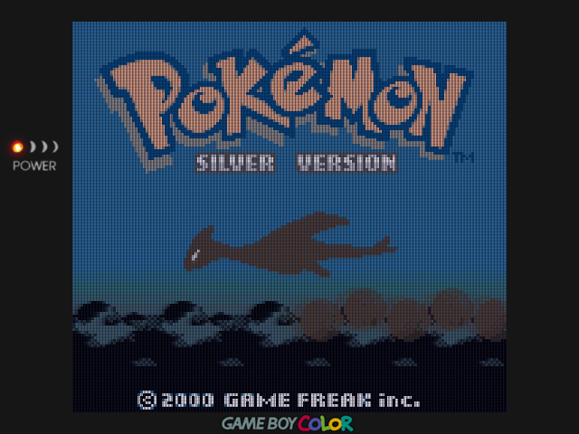
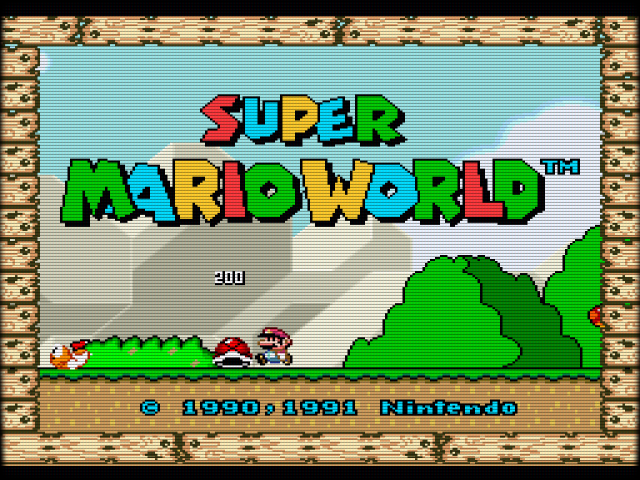

# Retro Gaming Handheld

Shaders, overlays, documentation, and a collection of information and utilities for personal use and needs.

## [RetroArch](https://www.retroarch.com/) Settings

### Game Boy ([GB](https://en.wikipedia.org/wiki/Game_Boy))

<table>
  <tr>
    <td style="text-align: center;">
      
      Raw
    </td>
    <td style="text-align: center;">
      
      Final
    </td>
  </tr>
</table>

#### CORE
Emulator core: [Gambatte](https://emulation.gametechwiki.com/index.php/Gambatte)

#### OVERLAY  &nbsp;&nbsp;&nbsp;&nbsp;&nbsp;&nbsp;&nbsp;[*Quick Menu → On-Screen Overlay*]
- **Display Overlay:** ON
- **Overlay Preset:** *overlays/codiox/default_gbp.cfg*
- **Overlay Opacity:** 1.00
- **Auto-Rotate Overlay:** OFF
- **Auto-Scale Overlay:** OFF

#### SHADERS  &nbsp;&nbsp;&nbsp;&nbsp;&nbsp;&nbsp;&nbsp;[*Quick Menu → Shaders*]
- **Video Shaders:** ON
- **Load Preset:** *shaders/codiox/GBP-Codiox/gbp-3x.glslp*
- **Save Preset → Save Content Directory Preset**

#### VIDEO  &nbsp;&nbsp;&nbsp;&nbsp;&nbsp;&nbsp;&nbsp;[*Settings → Video → Scaling*]
- **Integer Scale:** OFF
- **Integer Scale Overscale:** OFF

#### SAVE CHANGES
[Quick Menu → Overrides → Save Content Directory Overrides]

  

### Game Boy Color ([GBC](https://en.wikipedia.org/wiki/Game_Boy_Color))

<table>
  <tr>
    <td style="text-align: center;">
      
      Raw
    </td>
    <td style="text-align: center;">
      
      Final
    </td>
  </tr>
</table>

#### CORE
Emulator core: [Gambatte](https://emulation.gametechwiki.com/index.php/Gambatte)

#### OVERLAY  &nbsp;&nbsp;&nbsp;&nbsp;&nbsp;&nbsp;&nbsp;[*Quick Menu → On-Screen Overlay*]
- **Display Overlay:** ON
- **Overlay Preset:** *overlays/codiox/default_gbc.cfg*
- **Overlay Opacity:** 1.00
- **Auto-Rotate Overlay:** OFF
- **Auto-Scale Overlay:** OFF

#### SHADERS  &nbsp;&nbsp;&nbsp;&nbsp;&nbsp;&nbsp;&nbsp;[*Quick Menu → Shaders*]
- **Video Shaders:** OFF

#### VIDEO  &nbsp;&nbsp;&nbsp;&nbsp;&nbsp;&nbsp;&nbsp;[*Settings → Video → Scaling*]
- **Integer Scale:** ON
- **Integer Scale Overscale:** OFF
- **Aspect Ratio:** Core provided

#### MISCELLANEOUS &nbsp;&nbsp;&nbsp;&nbsp;&nbsp;&nbsp;&nbsp;[*Quick Menu → Core Options*]

- **GB Colorization:** GBC
- **Color Correction:** GBC Only
- **Color Correction Mode:** Accurate
- **Interframe Blending:** LCD Ghosting (Accurate)

#### SAVE CHANGES
[Quick Menu → Overrides → Save Content Directory Overrides]

  

### Game Boy Advance ([GBA](https://en.wikipedia.org/wiki/Game_Boy_Advance))

<table>
  <tr>
    <td style="text-align: center;">
      
      Raw
    </td>
    <td style="text-align: center;">
      
      Final
    </td>
  </tr>
</table>

#### CORE
Emulator core: [gpSP](https://emulation.gametechwiki.com/index.php/GpSP)

#### OVERLAY  &nbsp;&nbsp;&nbsp;&nbsp;&nbsp;&nbsp;&nbsp;[*Quick Menu → On-Screen Overlay*]
- **Display Overlay:** ON
- **Overlay Preset:** *overlays/perfect_overlays/GBA/Perfect_GBA.cfg*
- **Overlay Opacity:** 1.00
- **Auto-Rotate Overlay:** OFF
- **Auto-Scale Overlay:** OFF

#### SHADERS  &nbsp;&nbsp;&nbsp;&nbsp;&nbsp;&nbsp;&nbsp;[*Quick Menu → Shaders*]
- **Video Shaders:** OFF

#### VIDEO  &nbsp;&nbsp;&nbsp;&nbsp;&nbsp;&nbsp;&nbsp;[*Settings → Video → Scaling*]
- **Integer Scale:** OFF
- **Integer Scale Overscale:** OFF
- **Aspect Ratio:** Custom
- **Custom Aspect Ratio (X Position):** 0
- **Custom Aspect Ratio (Y Position):** 0
- **Custom Aspect Ratio (Width):** 640
- **Custom Aspect Ratio (height):** 427

#### MISCELLANEOUS &nbsp;&nbsp;&nbsp;&nbsp;&nbsp;&nbsp;&nbsp;[*Quick Menu → Core Options*]
- **BIOS:** Auto select
- **Boot mode:** Boot to BIOS
- **RTC support:** ON
- **Color Correction:** ON
- **Interframe Blending:** ON

#### SAVE CHANGES
[Quick Menu → Overrides → Save Core Overrides]

  

### Nintendo Entertainment System ([NES](https://en.wikipedia.org/wiki/Nintendo_Entertainment_System))

<table>
  <tr>
    <td style="text-align: center;">
      
      Raw
    </td>
    <td style="text-align: center;">
      
      Final
    </td>
  </tr>
</table>

#### CORE
* Emulator core: [FCEUmm](https://emulation.gametechwiki.com/index.php/FCEUX) (FCE Ultra "mappers modified")

#### OVERLAY  &nbsp;&nbsp;&nbsp;&nbsp;&nbsp;&nbsp;&nbsp;[*Quick Menu → On-Screen Overlay*]
- **Display Overlay:** ON
- **Overlay Preset:** *overlays/perfect_overlays/CRT/Perfect_CRT.cfg*
- **Overlay Opacity:** 1.00
- **Auto-Rotate Overlay:** OFF
- **Auto-Scale Overlay:** OFF

#### SHADERS  &nbsp;&nbsp;&nbsp;&nbsp;&nbsp;&nbsp;&nbsp;[*Quick Menu → Shaders*]
- **Video Shaders:** ON
- **Load Preset:** *shaders/interpolation/sharp-bilinear-2x-prescale.glslp*
- **Shader Passes:** 3
- **Shader #0:** (already seted by 'Load Preset')
- **Shader #1:** (already seted by 'Load Preset')
- **Shader #2:** *shaders/shimmerless/shaders/sharp-shimmerless.glsl*
- [Apply Changes]
- [Save Preset → Save Core Preset]

#### VIDEO  &nbsp;&nbsp;&nbsp;&nbsp;&nbsp;&nbsp;&nbsp;[*Settings → Video → Scaling*]
- **Integer Scale:** OFF
- **Integer Scale Overscale:** OFF
- **Aspect Ratio:** 4:3

#### MISCELLANEOUS &nbsp;&nbsp;&nbsp;&nbsp;&nbsp;&nbsp;&nbsp;[*Quick Menu → Core Options*]
- **Aspect Ratio:** 4:3
- **Crop Horizontal Left Overscan:** 8
- **Crop Horizontal Right Overscan:** 0
- **Crop Vertical Top Overscan:** 0
- **Crop Vertical Bottom Overscan:** 0

#### SAVE CHANGES
[Quick Menu → Overrides → Save Core Overrides]

  

### Super Nintendo Entertainment System ([SNES](https://www.gametechwiki.com/w/index.php/Super_Nintendo_Entertainment_System))

<table>
  <tr>
    <td style="text-align: center;">
      
      Raw
    </td>
    <td style="text-align: center;">
      
      Final
    </td>
  </tr>
</table>

#### CORE
* Emulator core: [Snes9x](https://emulation.gametechwiki.com/index.php/Snes9x)

#### OVERLAY  &nbsp;&nbsp;&nbsp;&nbsp;&nbsp;&nbsp;&nbsp;[*Quick Menu → On-Screen Overlay*]
- **Display Overlay:** ON
- **Overlay Preset:** *overlays/perfect_overlays/CRT/Perfect_CRT.cfg*
- **Overlay Opacity:** 1.00
- **Auto-Rotate Overlay:** OFF
- **Auto-Scale Overlay:** OFF

#### SHADERS  &nbsp;&nbsp;&nbsp;&nbsp;&nbsp;&nbsp;&nbsp;[*Quick Menu → Shaders*]
- **Video Shaders:** ON
- **Load Preset:** *shaders/interpolation/sharp-bilinear-2x-prescale.glslp*
- **Shader Passes:** 3
- **Shader #0:** (already seted by 'Load Preset')
- **Shader #1:** (already seted by 'Load Preset')
- **Shader #2:** *shaders/shimmerless/shaders/sharp-shimmerless.glsl*
- [Apply Changes]
- [Save Preset → Save Core Preset]

#### VIDEO  &nbsp;&nbsp;&nbsp;&nbsp;&nbsp;&nbsp;&nbsp;[*Settings → Video → Scaling*]
- **Integer Scale:** OFF
- **Integer Scale Overscale:** OFF
- **Aspect Ratio:** 4:3

#### MISCELLANEOUS &nbsp;&nbsp;&nbsp;&nbsp;&nbsp;&nbsp;&nbsp;[*Quick Menu → Core Options*]
- **Preferred Aspect Ratio:** 4:3
- **Crop Overscan:** OFF

#### SAVE CHANGES
[Quick Menu → Overrides → Save Core Overrides]