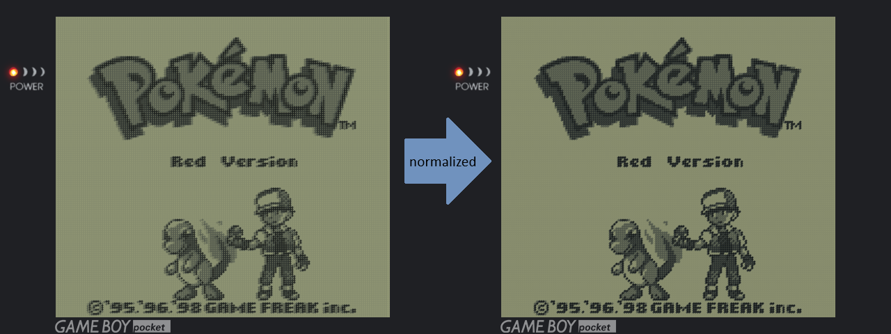

# Retro Gaming Handheld

Shaders, overlays, documentation, and a collection of information and utilities for personal use and needs.

## RetroArch Settings

   
 Game Boy (GB)

 

[raw image](assets/raw_gb.png)

#### CORE
[Gambatte](https://emulation.gametechwiki.com/index.php/Gambatte)

#### OVERLAY
<code style="color : darkseagreen;">[*Quick Menu → On-Screen Overlay*]</code>
- Display Overlay: ON
- Overlay Preset: <code style="color : darkseagreen;">overlays/codiox/default_gbp.cfg</code>
- Overlay Opacity: 1.00
- Auto-Rotate Overlay: OFF
- Auto-Scale Overlay: OFF

#### SHADERS
<code style="color : darkseagreen;">[*Quick Menu → Shaders*]</code>
- Video Shaders: ON
- Load Preset: <code style="color : darkseagreen;">shaders/codiox/GBP-Codiox/gbp-3x.glslp</code>
- Load Passes: 4
- Shader #3: <code style="color : darkseagreen;">shaders/shimmerless/sharp-shimmerless.glslp</code>
- **Apply Changes**
- Save Preset → **Save Content Directory Preset**

#### VIDEO
<code style="color : darkseagreen;">[*Settings → Video → Scaling*]</code>
- Integer Scale: OFF
- Integer Scale Overscale: OFF

#### SAVE CHANGES
<code style="color : gold;">[Quick Menu → Overrides → Save Content Directory Overrides]</code>

   
 Game Boy Color (GBC)

 
  

[raw image](assets/raw_gbc.png)

#### CORE
[Gambatte](https://emulation.gametechwiki.com/index.php/Gambatte)

#### OVERLAY
<code style="color : darkseagreen;">[*Quick Menu → On-Screen Overlay*]</code>
- Display Overlay: ON
- Overlay Preset: <code style="color : darkseagreen;">overlays/codiox/default_gbc.cfg</code>
- Overlay Opacity: 1.00
- Auto-Rotate Overlay: OFF
- Auto-Scale Overlay: OFF

#### SHADERS
<code style="color : darkseagreen;">[*Quick Menu → Shaders*]</code>
- Video Shaders: ON
- Load Passes: 1
- Shader #0: <code style="color : darkseagreen;">shaders/shimmerless/sharp-shimmerless.glslp</code>
- **Apply Changes**
- Save Preset → **Save Content Directory Preset**

#### VIDEO
<code style="color : darkseagreen;">[*Settings → Video → Scaling*]</code>
- Integer Scale: ON
- Integer Scale Overscale: OFF
- Aspect Ratio: Core provided

#### MISCELLANEOUS
<code style="color : darkseagreen;">[*Quick Menu → Core Options*]</code>

- GB Colorization: GBC
- Color Correction: GBC Only
- Color Correction Mode: Accurate
- Interframe Blending: LCD Ghosting (Accurate)

#### SAVE CHANGES
<code style="color : gold;">[Quick Menu → Overrides → Save Content Directory Overrides]</code>

   
 Game Boy Advance (GBA)

 

[raw image](assets/raw_gba.png)

#### CORE
[gpSP](https://emulation.gametechwiki.com/index.php/GpSP)

#### OVERLAY
<code style="color : darkseagreen;">[*Quick Menu → On-Screen Overlay*]</code>
- Display Overlay: ON
- Overlay Preset: <code style="color : darkseagreen;">overlays/perfect_overlays/GBA/Perfect_GBA.cfg</code>
- Overlay Opacity: 1.00
- Auto-Rotate Overlay: OFF
- Auto-Scale Overlay: OFF

#### SHADERS
<code style="color : darkseagreen;">[*Quick Menu → Shaders*]</code>
- Video Shaders: ON
- Load Passes: 1
- Shader #0: <code style="color : darkseagreen;">shaders/shimmerless/sharp-shimmerless.glslp</code>
- **Apply Changes**
- Save Preset → **Save Core Preset**

#### VIDEO
<code style="color : darkseagreen;">[*Settings → Video → Scaling*]</code>
- Integer Scale: OFF
- Integer Scale Overscale: OFF
- Aspect Ratio: Custom
- Custom Aspect Ratio (X Position): 0
- Custom Aspect Ratio (Y Position): 0
- Custom Aspect Ratio (Width): 640
- Custom Aspect Ratio (height): 427

#### MISCELLANEOUS
<code style="color : darkseagreen;">[*Quick Menu → Core Options*]</code>
- BIOS: Auto select
- Boot mode: Boot to BIOS
- RTC support: ON
- Color Correction: ON
- Interframe Blending: ON

#### SAVE CHANGES
<code style="color : gold;">[Quick Menu → Overrides → Save Core Overrides]</code>

   
 Nintendo Entertainment System (NES)

 

[raw image](assets/raw_nes.png)

#### CORE
[FCEUmm](https://emulation.gametechwiki.com/index.php/FCEUX) (FCE Ultra "mappers modified")

#### OVERLAY
<code style="color : darkseagreen;">[*Quick Menu → On-Screen Overlay*]</code>
- Display Overlay: ON
- Overlay Preset: <code style="color : darkseagreen;">overlays/perfect_overlays/CRT/Perfect_CRT.cfg</code>
- Overlay Opacity: 1.00
- Auto-Rotate Overlay: OFF
- Auto-Scale Overlay: OFF

#### SHADERS
<code style="color : darkseagreen;">[*Quick Menu → Shaders*]</code>
- Video Shaders: ON
- Load Passes: 1
- Shader #0: <code style="color : darkseagreen;">shaders/shimmerless/sharp-shimmerless.glslp</code>
- **Apply Changes**
- Save Preset → **Save Core Preset**

#### VIDEO
<code style="color : darkseagreen;">[*Settings → Video → Scaling*]</code>
- Integer Scale: OFF
- Integer Scale Overscale: OFF
- Aspect Ratio: 4:3

#### MISCELLANEOUS
<code style="color : darkseagreen;">[*Quick Menu → Core Options*]</code>
- Aspect Ratio: 4:3
- Crop Horizontal Left Overscan: 8
- Crop Horizontal Right Overscan: 0
- Crop Vertical Top Overscan: 0
- Crop Vertical Bottom Overscan: 0

#### SAVE CHANGES
<code style="color : gold;">[Quick Menu → Overrides → Save Core Overrides]</code>

   
 Super Nintendo Entertainment System (SNES)

 

[raw image](assets/raw_snes.png)

#### CORE
[Snes9x](https://emulation.gametechwiki.com/index.php/Snes9x)

#### OVERLAY
<code style="color : darkseagreen;">[*Quick Menu → On-Screen Overlay*]</code>
- Display Overlay: ON
- Overlay Preset: <code style="color : darkseagreen;">overlays/perfect_overlays/CRT/Perfect_CRT.cfg</code>
- Overlay Opacity: 1.00
- Auto-Rotate Overlay: OFF
- Auto-Scale Overlay: OFF

#### SHADERS
<code style="color : darkseagreen;">[*Quick Menu → Shaders*]</code>
- Video Shaders: ON
- Load Passes: 1
- Shader #0: <code style="color : darkseagreen;">shaders/shimmerless/sharp-shimmerless.glslp</code>
- **Apply Changes**
- Save Preset → **Save Core Preset**

#### VIDEO
<code style="color : darkseagreen;">[*Settings → Video → Scaling*]</code>
- Integer Scale: OFF
- Integer Scale Overscale: OFF
- Aspect Ratio: 4:3

#### MISCELLANEOUS
<code style="color : darkseagreen;">[*Quick Menu → Core Options*]</code>
- Preferred Aspect Ratio: 4:3
- Crop Overscan: OFF

#### SAVE CHANGES
<code style="color : gold;">[Quick Menu → Overrides → Save Core Overrides]</code>

## Shaders Concepts

- Shaders are small programs written in specific programming languages.
- They function as graphics filters, significantly enhancing the rendering quality of old games.
- Shaders can also replicate the appearance of old CRT monitors, early LCD displays, and other vintage visuals.

- There are three file extension possibilities for shaders:
    - **.cpg** - [CG] An old, deprecated format.
    - **.glslp** - [GLSL] Compatible with the OpenGL video driver.
    - **.slangp** - [Slang] Compatible with Vulkan, Direct3D, and OpenGL Core.

[source/more info](https://docs.libretro.com/shader/introduction/)

### Pixel Normalization

Pixel normalization refers to methods used to scale and display images in a way that preserves the visual integrity of the original artwork. "Ideal" pixels maintain the same shape, with no distortion or blurring, and this is often referred to as having "sharp pixels."

Popular algorithms:
- [Sharp-Shimmerless](https://github.com/Woohyun-Kang/Sharp-Shimmerless-Shader?tab=readme-ov-file)
- [Sharp-Bilinear](https://github.com/rsn8887/Sharp-Bilinear-Shaders)

<table>
  <tr>
    <td style="text-align: center;">
      
       
Not normalized pixels

    </td>
    <td style="text-align: center;">
      
       
Normalized pixels

    </td>
  </tr>
</table>

[source/more info](https://gamingprojects.wordpress.com/2017/12/03/reducing-pixel-blur-and-distortion/)

## Credits
- [ourigen](https://github.com/ourigen/perfect_overlays)
- [Woohyun Kang](https://github.com/Woohyun-Kang/Sharp-Shimmerless-Shader)
- [Codiox](https://discord.com/channels/1152022492001603615/1241842963126943808/1241842963126943808)
